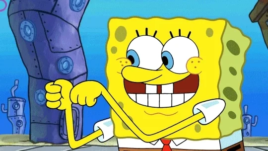

<div class="absolute top-10">
  <span  class="font-700">
    by Song Yanfeng
  </span>
</div>

<div  class="absolute bottom-10">
  <h1>来一起学Python吧！</h1>
  <p>准备好进入编程的世界了吗？</p>
</div>

---
layout: statement
---

# 第1课：魔法咒语 ✨

---
layout: quote
---


# print("Hello World!")

就像用魔法笔写字：

```python {none|1|2|}{at:'1'}
print("你好，小冒险家！🐾")
print("1 + 2 =", 1+2) 
```

---
layout: section
---

👉 试试看：
- 让电脑说你的名字
- 让电脑算3+5



---
layout: statement
---

# 第2课：魔法盒子 📦

---
layout: section
---

# 变量就像贴标签的盒子


```python {none|1-3|5-6|}
# 给盒子贴标签
我的玩具 = "遥控汽车"
数量 = 3

# 看看盒子里有什么
print("我有", 数量, "辆", 我的玩具)
```

<v-clicks>

🎮 生活小例子：
- 糖果罐子（水果糖=10）
- 存钱罐（硬币=25元）

</v-clicks>


---
layout: image-right
---

# 变量变变变 🎨

<div class="absolute top-30 w-80">
```python
# 颜色魔法
最喜欢的颜色 = "蓝色"
print("现在喜欢", 最喜欢的颜色)

最喜欢的颜色 = "彩虹色"  # 🌈
print("现在喜欢", 最喜欢的颜色)
```
</div>

<div class="absolute top-80">
<v-clicks>

📝 小任务：
- 创建「冰淇淋口味」变量
- 改变它的味道
- 展示变化

</v-clicks>
</div>


---
layout: section
class: "text-center"
---

# 闯关成功！ 🎉

---
class: "text-center"
layout: two-cols
---
<div v-click class="absolute top-50 left-50 text-center">

你已经学会了：

✅ 用print说你好  
✅ 创建变量盒子  
✅ 改变变量内容

</div>

::right::

<div v-click class="absolute top-50 left-150 text-center slidev-vclick-target">


下次我们会学习：

🕹️ 游戏控制台  
🎲 猜数字游戏  

</div>

---
layout: fact
---

# 保持好奇心！✨
# 我们下次见！🪄